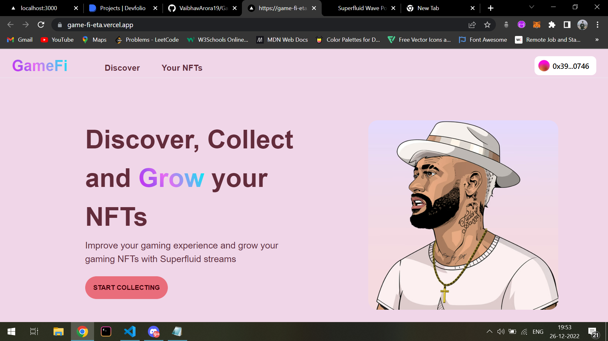
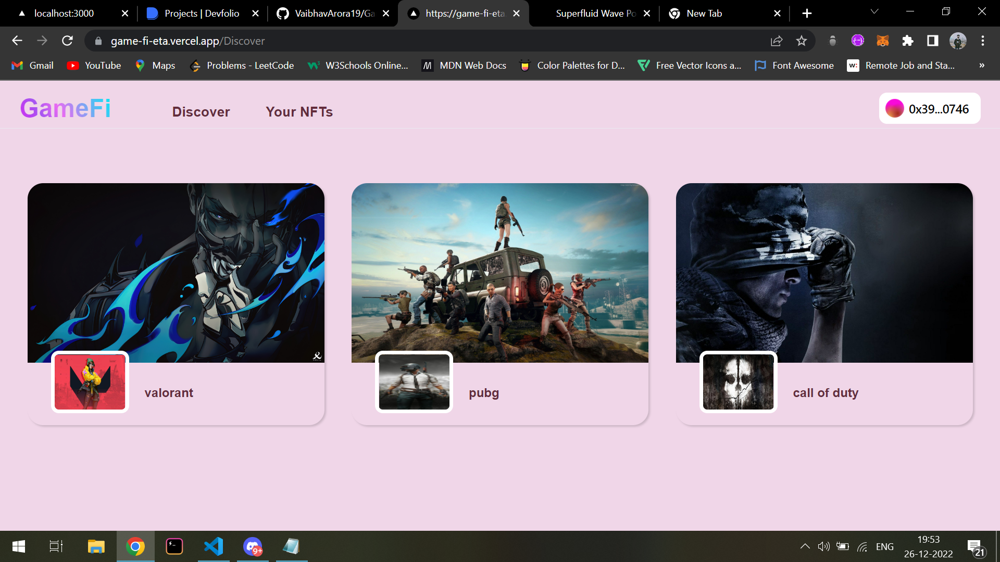
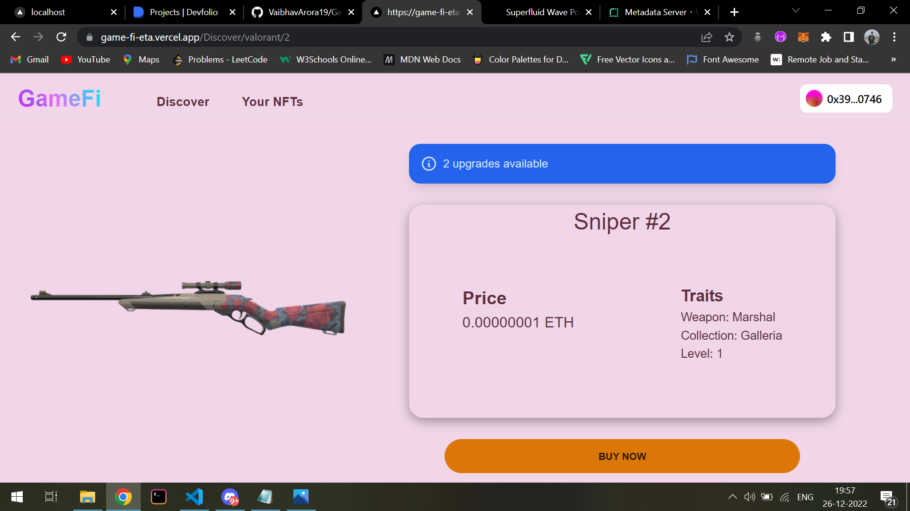
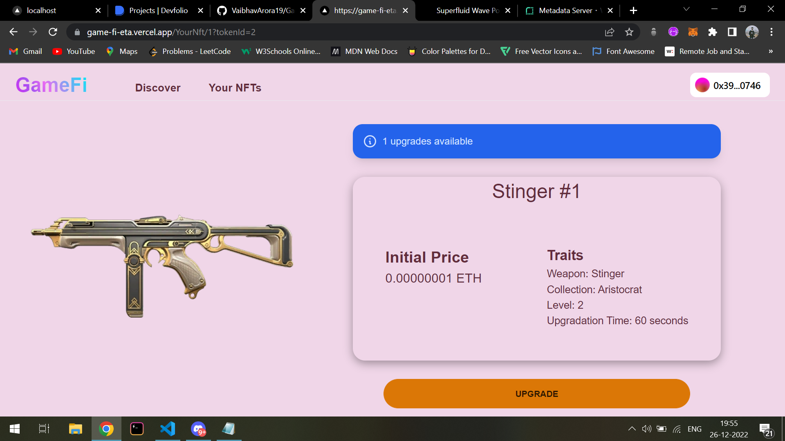

<h1 align = "center">GameFi 🎮</h1>

With the rise of blockchain and popularity of NFTs, we also needed a way to make the gaming experience better using this technology. Imagine a user avatar upgrades every second according to the amount of time they spent on that particular game or a weapon gets upgraded after a certain amount of time based on how much time he spent using that weapon. That's why I built GameFi. GameFi is a NFT marketplace that allows you to grow your NFTs using superfluid streams making the NFTs look more alive. Your gaming NFT starts upgrading as soon as you start streaming super tokens to it. GameFi has several games list and with each game several NFTs attached to that particular game. A user can upgrade their NFT by streaming super tokens to it. There are several levels available for each NFT and each NFT can be upgraded to the next level by streaming super tokens to it for a certain amount of time. In the near future this same concept can be used to make the in-game NFTs upgradeable depending on how much a user spends time on that paritcular game.

 
 

## How it works :
 
<ul>
  <li>Go to Discover Page to collect an NFT</li>
  <li>Find the NFT you find most intimidating</li>
  <li>Buy the NFT</li>
  <li>Go to yourNFT page to see your NFTs</li>
  <li>Select an NFT</li>
  <li>Start growing your NFT with superfluid streams🥳</li>
 </ul>

 
 

## 🌞 Screenshots

 
 

 
 

 
 

 
 

## 👩‍🔧 Contributing

To start contributing make sure you have <a href = "https://nodejs.org/en/download/">Nodejs</a> and <a href = "https://git-scm.com/">Git</a> installed in your system.

 After installing following requirements, perform the following steps -

 - Fork the repository.
 - Clone the repository using `git clone <repository-url>`
 - Create a new branch using `git checkout -b <branch-name>`
 - Change the directory to app using `cd app`
 - Install dependencies using `npm install`
 - Run the app using `npm run dev`
 - Once you are done making your changes stage your changes using `git add .`
 - Commit your changes using `git commit -m "message"`
 - Push your changes to the remote repository using `git push origin <branch-name>`

 
Note: Making any changes to the smart contract is not allowed currently because of the immutable nature of smart contracts. To submit any changes smart contracts needs to be redeployed that will result in loosing all the previous data.

 
 

## 🤔 Bug Reports/Feature Requests

Kindly open an issue if you face any king of bug or any other kind of problem by going to the issues tab and clicking on new issue. You can also request for a new feature by opening a new issue.

## Support

Kindly support me if you like the project by starring 🌟 the project. It'll be much appreciated 😄.